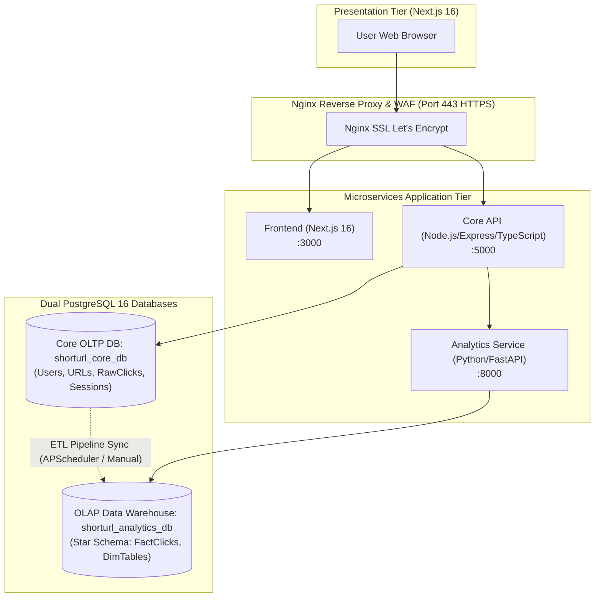
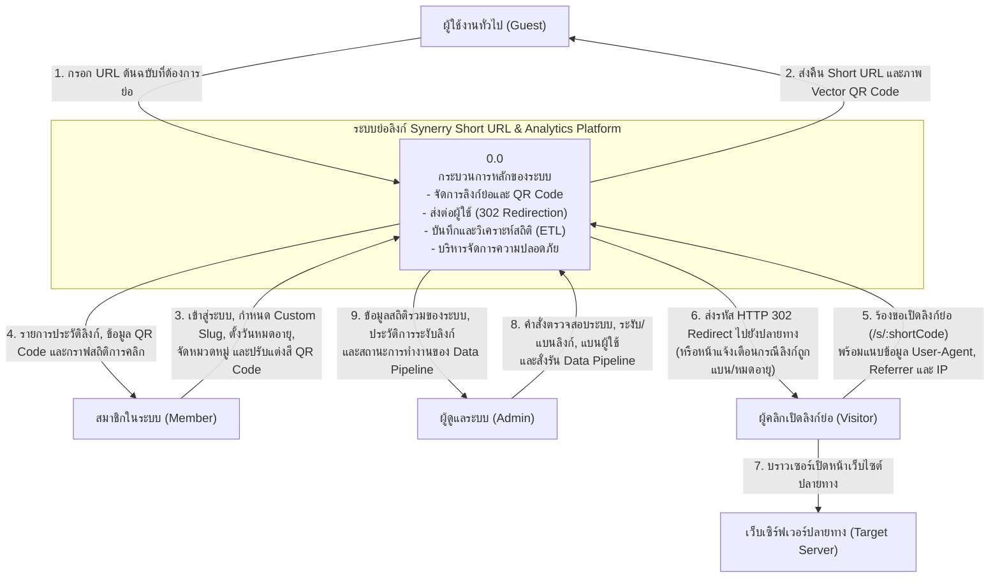
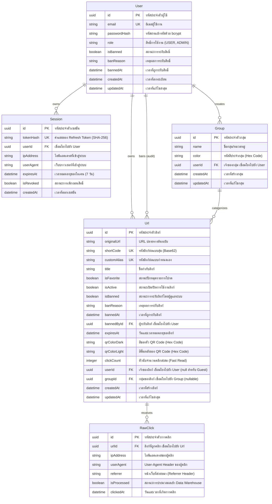

# Synerry Corporation — Developer Examination: Enterprise Short URL & Analytics Platform
## Core Backend API Service (`synerry-shortener-backend`)

บริการประมวลผลหลัก (Core API Service) พัฒนาด้วย Node.js, Express.js, TypeScript และ Prisma ORM ดูแลงานระบบ Authentication (JWT Rotation), URL Management, Base62 Generation, Sub-20ms HTTP 302 Redirection, และ Raw Click Ingestion

---

## ข้อมูลการส่งแบบทดสอบและการเข้าใช้งาน (Submission & Live Testing)

* **URL สำหรับทดสอบระบบออนไลน์**: [https://synerry-shortener.eastasia.cloudapp.azure.com](https://synerry-shortener.eastasia.cloudapp.azure.com)
* **ลิงก์ Repositories ของระบบทั้งหมด (Microservices Architecture)**:
  * **Frontend Repository**: [https://github.com/sangketkit01/synerry-shortener-frontend](https://github.com/sangketkit01/synerry-shortener-frontend)
  * **Core Backend Repository**: [https://github.com/sangketkit01/synerry-shortener-backend](https://github.com/sangketkit01/synerry-shortener-backend)
  * **Analytics Engine Repository**: [https://github.com/sangketkit01/synerry-shortener-analytic](https://github.com/sangketkit01/synerry-shortener-analytic)

### ข้อมูลบัญชีผู้ใช้สำหรับทดสอบ (Test Credentials)

| บทบาท (Role) | อีเมล (Email) | รหัสผ่าน (Password) | สิทธิ์การเข้าถึง |
|---|---|---|---|
| **System Administrator** | `admin@synerry.com` | `Admin@123456` | บริหารจัดการระบบ, ตรวจสอบผู้ใช้, ระงับ/แบนลิงก์, ระงับบัญชีผู้ใช้ และสั่งรัน ETL Pipeline |
| **Standard User** | `demo@synerry.com` | `Demo@123456` | ย่อลิงก์, กำหนด Custom Slug, ตั้งวันหมดอายุ, จัดหมวดหมู่, ดูสถิติกราฟ และ Export CSV |

---

## ตารางสรุปการตอบโจทย์ตามเกณฑ์การตัดสิน (Exam Criteria Compliance)

| ข้อที่ | เกณฑ์การพิจารณาตามโจทย์ | ผลลัพธ์ในระบบ | ฟังก์ชันและการทำงานที่พัฒนา |
|:---:|---|:---:|---|
| **1** | **Data Flow Diagram (DFD Level 0)** | **ผ่านสมบูรณ์** | ออกแบบ DFD Level 0 (Context Diagram) ครอบคลุมการทำงานทั้ง Guest, User, Admin, Visitor และ Data Store ชัดเจน |
| **2** | **Entity-Relationship Diagram (ERD)** | **ผ่านสมบูรณ์** | ออกแบบ ER Diagram แสดงความสัมพันธ์ตารางอย่างครบถ้วน โดยแยกขาดระหว่าง Core OLTP และ Analytics OLAP Star Schema |
| **3** | **สาธิตการสร้าง Short URL ได้** | **ผ่านสมบูรณ์** | กรอก Long URL และสร้าง Short URL ได้จริง รองรับ Base62 Slug และ Custom Alias และคลิกเปิดไปยัง URL ต้นฉบับด้วย HTTP 302 Redirection ในเวลา < 15ms |
| **4** | **สาธิตการสร้าง QR Code ของ Short URL ได้** | **ผ่านสมบูรณ์** | สร้าง QR Code แบบ Real-time Vector สามารถสแกนด้วยกล้องมือถือเพื่อวิ่งไปยัง URL ปลายทางได้จริง พร้อมปรับสีพื้นหน้า/พื้นหลัง และดาวน์โหลดเป็น PNG หรือ SVG |
| **5** | **สาธิตการเก็บประวัติและแสดงสถิติการคลิก** | **ผ่านสมบูรณ์** | มีหน้า Dashboard แสดงรายการประวัติลิงก์ และหน้า Analytics แสดงสถิติการคลิก, กราฟแนวโน้ม 7 วัน, แยกประเภทอุปกรณ์, เว็บบราวเซอร์, ระบบปฏิบัติการ และประเทศ |
| **6** | **ฟังก์ชันเพิ่มเติม / Microservices / Architecture** | **พิจารณาเป็นพิเศษ** | สถาปัตยกรรม Microservices 3 ชั้น, แยกฐานข้อมูล Core OLTP และ Analytics OLAP, ระบบ Data Pipeline (ETL) ป้องกันคอขวด, และระบบรักษาความปลอดภัยบัญชี |

---

## สถาปัตยกรรมระบบ Microservices (Architecture Diagram)



---

## แผนภาพกระแสข้อมูล: Data Flow Diagram (DFD Level 0)



---

## แผนผังความสัมพันธ์ข้อมูล: Entity-Relationship Diagram (ERD)

### Core Database (OLTP: `shorturl_core_db`)


---

## คู่มือการติดตั้งและเริ่มใช้งานในเครื่อง (Local Installation)

### วิธีที่ 1: รันผ่าน Docker Compose
```bash
cd ..
docker compose up -d
```

### วิธีที่ 2: รันเฉพาะ Backend API
```bash
# 1. ติดตั้ง Dependencies
npm install

# 2. ตั้งค่าไฟล์ .env
cp .env.example .env

# 3. รัน Database Migration และ Seed บัญชีผู้ใช้เริ่มต้น
npx prisma migrate dev
npx ts-node prisma/seed.ts

# 4. เริ่มรัน Backend ในโหมดพัฒนา
npm run dev
# ทำงานที่ http://localhost:5000
```
